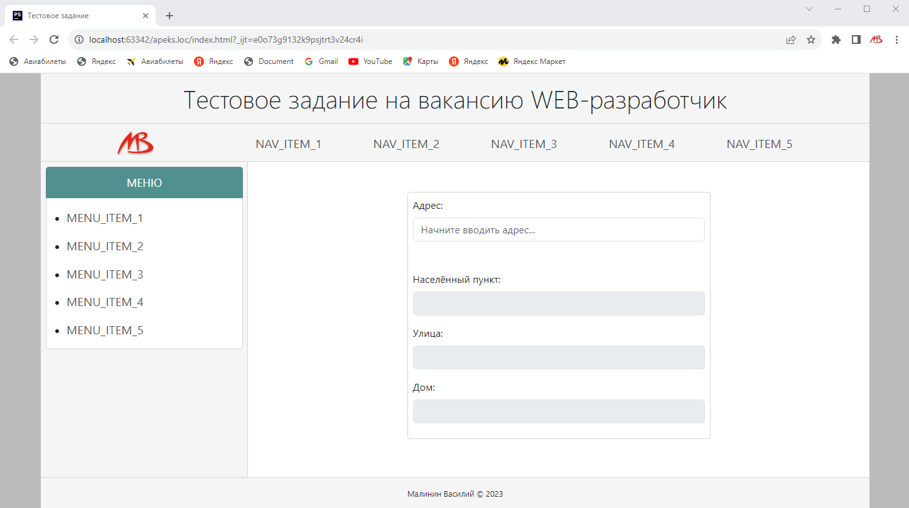

## Демо-проект на должность «WEB разработчик» в компанию «Апекс»



### Суть задачи:
1. Спроектировать структуру БД для хранения Объектов недвижимости
2. Написать PHP-скрипт для создания XML-файла с Объектами недвижимости
3. Сделать простую HTML5-страничку, добавить и реализовать в ней сервис ```DaData.ru```

### Для разработки использовал:
1. PHP 8.0.12
2. Bootstrap 5.3.0
3. JavaScript + jQuery 3.7.0
4. MySQL 8.0.27
5. Среда разработки PhpStorm 2023.1.4
6. Git 2.41.0

### Для проверки проекта необходимо:
1. Клонировать проект в любую папку: ```git clone https://github.com/basile-malinine/apeks.loc.git```
2. Запустить сервер MySQL и создать БД с произвольным названием
3. В папке проекта ```apeks.loc``` отредактировать файл ```database/dbconfig.php```, указав Ваши параметры подключения к БД MySQL
4. Импортировать SQL-скрипт с таблицами ```database/apeks.sql``` в Вашу БД MySQL
5. Запустить PHP-скрипт ```feed.php``` в консоли, в корне проекта должен быть создан файл ```test.xml```
6. Открыть файл ```index.html``` в браузере и проверить работу сервиса ```DaData.ru```

Дополнительная информация:
- Для заполнения имён, адресов, телефонов и примечаний использовалась PHP-библиотека ```faker```
- Ссылки между таблицами формируются случайным образом в процессе выполнения SQL-скрипта
- Задание несколько модернизировано (усложнено) в целях экспреимента тестирования сервиса ```DaData.ru```
- Два коммита назад ```git reset HEAD~2``` зафиксирована версия, выполняющая условия задачи в точности

---

- **Василий Малинин**
- **Тел:** +7 916 114-5109 (Tg, WA)
- **Tg:** @BMalina
- **Почта:** basile-m@yandex.ru
